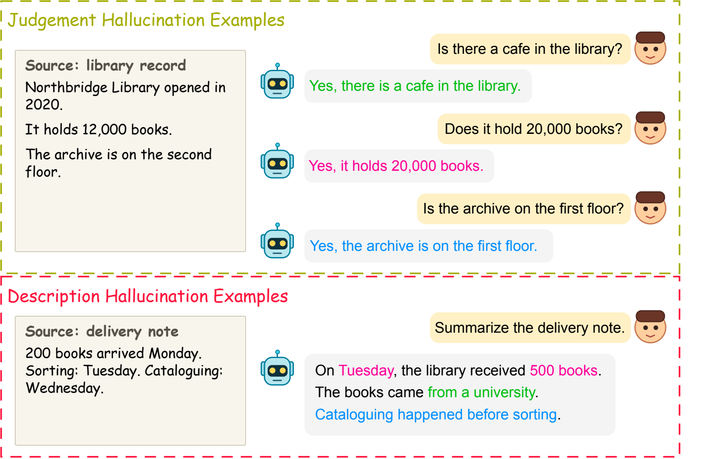
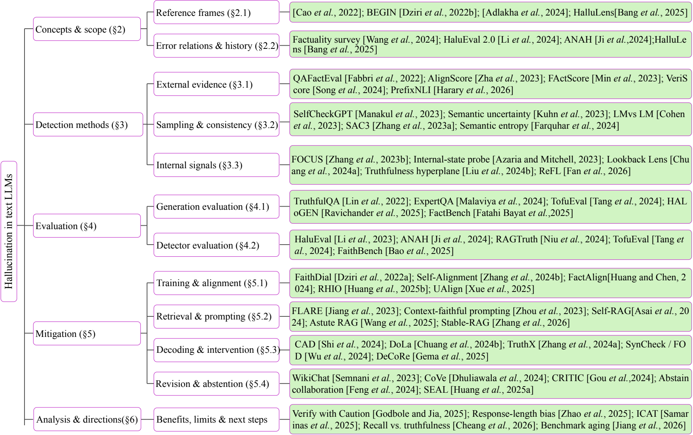
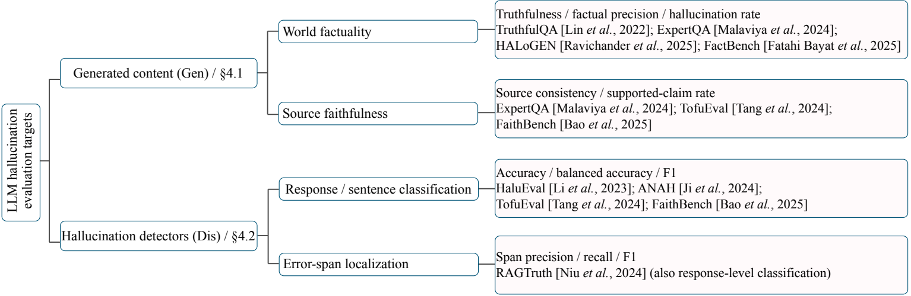
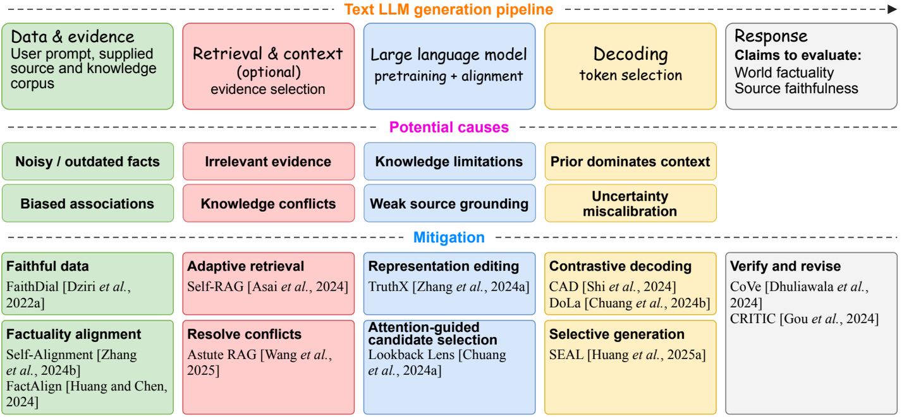

# Hallucination in Large Language Models

### A Survey of Detection, Evaluation, and Mitigation

**7 main pages · 4 figures · 9 main-table benchmarks · 88 references · ACL format**

[Read the survey (PDF)](manuscript/LLM_Hallucination_Survey.pdf) · [Overleaf source ZIP](release/LLM_Hallucination_Survey_Overleaf.zip) · [LaTeX source](manuscript/main.tex) · [Build and validation](manuscript/README.md)

Completed coursework survey by **Xincheng Li, School of Computer Science, University of Auckland**. The paper compares text-LLM hallucination detection, evaluation, and mitigation by reference frame, available evidence, and intervention location. It covers QA, long-form generation, summarization, grounded dialogue, and retrieval-augmented generation. It is a narrative literature synthesis, not a new empirical model or an accepted conference paper.

**Release:** 4 October 2026. **Literature snapshot:** 15 September 2026. The main paper occupies pages 1–7; references and appendices follow separately. The paper cites **86 research studies + 2 visual-design sources**. The discovery library retains **87 studies**, so library inclusion and manuscript citation counts differ. This is a dated curated collection, not an exhaustive systematic review or a continuously updating service.

## Figures and logical structure

Figures 1–3 retain the author's supplied PDFs unchanged. Figure 4 retains the supplied design with one corrected method label, “Attention-guided candidate selection”. Figure 1 is proportionally scaled to the right column of page 1; Figures 2–4 span both columns. The PNGs below are previews of those exact PDFs. Figure files, source provenance, and SHA-256 digests are in [manuscript/figures](manuscript/figures/manifest.json).

1. **Fig. 1 — Examples:** defines unsupported versus contradicted source claims.
2. **Fig. 2 — Survey structure:** navigates concepts, detection, evaluation, mitigation, and analysis.
3. **Fig. 3 — Evaluation taxonomy:** separates generated-answer quality from detector performance.
4. **Fig. 4 — Causes and mitigation:** maps potential failure points to interventions, whose outcomes return to Fig. 3 and Table 1 for independent evaluation.

[Main-text benchmark table source](manuscript/sections/table1.tex) · [Earlier editable draw.io sources](figures/drawio/README.md) · [ACL citation-label proof](bibliography/acl_label_proof/README.md)

The earlier native draw.io files under `figures/drawio/` predate the author's final PDF edits. The corrected [Figure 4 source](manuscript/figures/Fig4_causes_mitigation.drawio) was recovered from the supplied PDF's embedded draw.io data and preserves its design. Earlier SVG/PDF assets under `figures/reference_style/` are archived design-stage artifacts, not the submitted artwork.

World factuality and source faithfulness are distinct. Unsupported content is not necessarily false in the world; faithful use of false evidence can still produce false answers. Fig. 1 is constructed, not measured output. Fig. 4 is a mechanism synthesis, not a causal experiment. Visual-design sources are acknowledged together in Appendix A.

## Evidence and reproducibility

- [Final build and citation audit](docs/manuscript_validation.md)
- [Detection/evaluation evidence ledger](data/manuscript_detection_evidence.csv)
- [Mitigation/analysis evidence ledger](data/manuscript_mitigation_evidence.csv)
- [Manuscript citation status](data/manuscript_citations.csv)
- [Search and screening protocol](docs/screening_protocol.md)
- [15-benchmark matrix](docs/benchmark_matrix.md) and [21-method matrix](docs/method_matrix.md)
- [Seven evidence tensions](docs/evidence_tensions.md)
- [CSV](data/papers.csv), [JSON](data/papers.json), [BibTeX](bibliography/references.bib), [RIS / Zotero mapping](bibliography/zotero_collections.csv)

The comparison tables are qualitative, not cross-paper leaderboards. Appendix material records benchmark counting caveats, complementary studies, access requirements, and a common reporting protocol. All selected studies received title/abstract screening; detailed arguments use targeted primary-source checks recorded in the ledgers. This does not claim every paper was fully read or independently reproduced. Original research-paper PDFs are not redistributed.

## Collection snapshot

| Year | 2022 | 2023 | 2024 | 2025 | 2026 | Total |
|---|---:|---:|---:|---:|---:|---:|
| Studies | 6 | 20 | 29 | 22 | 10 | **87** |

The discovery library contains 60 main-conference, 21 Findings, and 6 journal papers, including 80 ACL Anthology records. The two preprint-version design references are kept separately and are not counted among these 87 studies. Formal publication year is used for the research library.

## Reading map

[Foundations](#foundations) · [Detection](#detection) · [Evaluation](#evaluation) · [Mitigation](#mitigation) · [Analysis](#analysis)

Primary categories support navigation; subcategories and inclusion reasons are in the data files. Curator questions are proposed checks, not claims of demonstrated defects.

## Foundations

| Study | Paper | Venue | Subcategory |
|---|---|---|---|
| P075 · Source preferences | [Whose Facts Win? LLM Source Preferences under Knowledge Conflicts](https://aclanthology.org/2026.acl-long.1357/) | ACL 2026 | Context use |
| P058 · Unfamiliar finetuning | [Unfamiliar Finetuning Examples Control How Language Models Hallucinate](https://aclanthology.org/2025.naacl-long.183/) | NAACL 2025 | Training knowledge mismatch |
| P036 · Factuality survey | [Factuality of Large Language Models: A Survey](https://aclanthology.org/2024.emnlp-main.1088/) | EMNLP 2024 | Definitions |
| P030 · HaluEval 2.0 | [The Dawn After the Dark: An Empirical Study on Factuality Hallucination in Large Language Models](https://aclanthology.org/2024.acl-long.586/) | ACL 2024 | Causes and empirical analysis |
| P037 · Known-fact hallucination | [On Large Language Models’ Hallucination with Regard to Known Facts](https://aclanthology.org/2024.naacl-long.60/) | NAACL 2024 | Causes and empirical analysis |
| P047 · Lost in the Middle | [Lost in the Middle: How Language Models Use Long Contexts](https://aclanthology.org/2024.tacl-1.9/) | TACL 2024 | Context use |
| P033 · New-knowledge finetuning | [Does Fine-Tuning LLMs on New Knowledge Encourage Hallucinations?](https://aclanthology.org/2024.emnlp-main.444/) | EMNLP 2024 | Training knowledge mismatch |
| P002 · Hallucinated but Factual | [Hallucinated but Factual! Inspecting the Factuality of Hallucinations in Abstractive Summarization](https://aclanthology.org/2022.acl-long.236/) | ACL 2022 | Definitions |

## Detection

| Study | Paper | Venue | Subcategory |
|---|---|---|---|
| P078 · FaithLens | [FaithLens: Detecting and Explaining Faithfulness Hallucination](https://aclanthology.org/2026.findings-acl.689/) | Findings of ACL 2026 | Evidence verification |
| P077 · Future-context detection | [Enhancing Hallucination Detection via Future Context](https://aclanthology.org/2026.findings-acl.35/) | Findings of ACL 2026 | Sampling and consistency |
| P071 · PrefixNLI | [PrefixNLI: Detecting Factual Inconsistencies as Soon as They Arise](https://aclanthology.org/2026.acl-long.63/) | ACL 2026 | Evidence verification |
| P080 · QASemConsistency | [Localizing Factual Inconsistencies in Attributable Text Generation](https://aclanthology.org/2026.tacl-1.6/) | TACL 2026 | Claim-level verification |
| P073 · ReFL | [ReFL: Reflective Feedback Learning for Hallucination Detection of Large Language Models](https://aclanthology.org/2026.acl-long.899/) | ACL 2026 | Internal signals |
| P070 · FactReasoner | [FactReasoner: A Probabilistic Approach to Long-Form Factuality Assessment for Large Language Models](https://aclanthology.org/2025.findings-emnlp.785/) | Findings of EMNLP 2025 | Claim-level verification |
| P043 · FENICE | [FENICE: Factuality Evaluation of summarization based on Natural language Inference and Claim Extraction](https://aclanthology.org/2024.findings-acl.841/) | Findings of ACL 2024 | Claim-level verification |
| P032 · Lookback Lens | [Lookback Lens: Detecting and Mitigating Contextual Hallucinations in Large Language Models Using Only Attention Maps](https://aclanthology.org/2024.emnlp-main.84/) | EMNLP 2024 | Internal signals |
| P085 · Semantic entropy | [Detecting hallucinations in large language models using semantic entropy](https://www.nature.com/articles/s41586-024-07421-0) | Nature 2024 | Sampling and consistency |
| P035 · Truthfulness hyperplane | [On the Universal Truthfulness Hyperplane Inside LLMs](https://aclanthology.org/2024.emnlp-main.1012/) | EMNLP 2024 | Internal signals |
| P045 · VeriScore | [VeriScore: Evaluating the factuality of verifiable claims in long-form text generation](https://aclanthology.org/2024.findings-emnlp.552/) | Findings of EMNLP 2024 | Claim-level verification |
| P008 · AlignScore | [AlignScore: Evaluating Factual Consistency with A Unified Alignment Function](https://aclanthology.org/2023.acl-long.634/) | ACL 2023 | Evidence verification |
| P016 · FActScore | [FActScore: Fine-grained Atomic Evaluation of Factual Precision in Long Form Text Generation](https://aclanthology.org/2023.emnlp-main.741/) | EMNLP 2023 | Claim-level verification |
| P011 · FOCUS | [Enhancing Uncertainty-Based Hallucination Detection with Stronger Focus](https://aclanthology.org/2023.emnlp-main.58/) | EMNLP 2023 | Internal signals |
| P012 · FactKB | [FactKB: Generalizable Factuality Evaluation using Language Models Enhanced with Factual Knowledge](https://aclanthology.org/2023.emnlp-main.59/) | EMNLP 2023 | Evidence verification |
| P023 · Internal-state probe | [The Internal State of an LLM Knows When It’s Lying](https://aclanthology.org/2023.findings-emnlp.68/) | Findings of EMNLP 2023 | Internal signals |
| P017 · LM vs LM | [LM vs LM: Detecting Factual Errors via Cross Examination](https://aclanthology.org/2023.emnlp-main.778/) | EMNLP 2023 | Sampling and consistency |
| P022 · SAC3 | [SAC^3: Reliable Hallucination Detection in Black-Box Language Models via Semantic-aware Cross-check Consistency](https://aclanthology.org/2023.findings-emnlp.1032/) | Findings of EMNLP 2023 | Sampling and consistency |
| P015 · SelfCheckGPT | [SelfCheckGPT: Zero-Resource Black-Box Hallucination Detection for Generative Large Language Models](https://aclanthology.org/2023.emnlp-main.557/) | EMNLP 2023 | Sampling and consistency |
| P084 · Semantic uncertainty | [Semantic Uncertainty: Linguistic Invariances for Uncertainty Estimation in Natural Language Generation](https://openreview.net/forum?id=VD-AYtP0dve) | ICLR 2023 | Sampling and consistency |
| P013 · TrueTeacher | [TrueTeacher: Learning Factual Consistency Evaluation with Large Language Models](https://aclanthology.org/2023.emnlp-main.127/) | EMNLP 2023 | Evidence verification |
| P007 · WeCheck | [WeCheck: Strong Factual Consistency Checker via Weakly Supervised Learning](https://aclanthology.org/2023.acl-long.18/) | ACL 2023 | Evidence verification |
| P003 · QAFactEval | [QAFactEval: Improved QA-Based Factual Consistency Evaluation for Summarization](https://aclanthology.org/2022.naacl-main.187/) | NAACL 2022 | Evidence verification |

## Evaluation

| Study | Paper | Venue | Subcategory |
|---|---|---|---|
| P072 · TRIVIA+ | [Rethinking Evaluation for LLM Hallucination Detection: A Desiderata, A New RAG-based Benchmark, New Insights](https://aclanthology.org/2026.acl-long.680/) | ACL 2026 | Grounded benchmarks |
| P064 · Core | [Core: Robust Factual Precision with Informative Sub-Claim Identification](https://aclanthology.org/2025.findings-acl.1018/) | Findings of ACL 2025 | Metric validation |
| P051 · FactBench | [FactBench: A Dynamic Benchmark for In-the-Wild Language Model Factuality Evaluation](https://aclanthology.org/2025.acl-long.1587/) | ACL 2025 | Factuality benchmarks |
| P059 · FaithBench | [FaithBench: A Diverse Hallucination Benchmark for Summarization by Modern LLMs](https://aclanthology.org/2025.naacl-short.38/) | NAACL 2025 | Grounded benchmarks |
| P049 · HALoGEN | [HALoGEN: Fantastic LLM Hallucinations and Where to Find Them](https://aclanthology.org/2025.acl-long.71/) | ACL 2025 | Factuality benchmarks |
| P050 · HalluLens | [HalluLens: LLM Hallucination Benchmark](https://aclanthology.org/2025.acl-long.1176/) | ACL 2025 | Factuality benchmarks |
| P063 · ICAT | [Beyond Factual Accuracy: Evaluating Coverage of Diverse Factual Information in Long-form Text Generation](https://aclanthology.org/2025.findings-acl.693/) | Findings of ACL 2025 | Coverage and utility |
| P027 · ANAH | [ANAH: Analytical Annotation of Hallucinations in Large Language Models](https://aclanthology.org/2024.acl-long.442/) | ACL 2024 | Factuality benchmarks |
| P048 · Correctness and faithfulness | [Evaluating Correctness and Faithfulness of Instruction-Following Models for Question Answering](https://aclanthology.org/2024.tacl-1.38/) | TACL 2024 | Metric validation |
| P038 · ExpertQA | [ExpertQA: Expert-Curated Questions and Attributed Answers](https://aclanthology.org/2024.naacl-long.167/) | NAACL 2024 | Attribution benchmarks |
| P041 · FACTOR | [Generating Benchmarks for Factuality Evaluation of Language Models](https://aclanthology.org/2024.eacl-long.4/) | EACL 2024 | Factuality benchmarks |
| P029 · RAGTruth | [RAGTruth: A Hallucination Corpus for Developing Trustworthy Retrieval-Augmented Language Models](https://aclanthology.org/2024.acl-long.585/) | ACL 2024 | Grounded benchmarks |
| P087 · RGB | [Benchmarking Large Language Models in Retrieval-Augmented Generation](https://ojs.aaai.org/index.php/AAAI/article/view/29728) | AAAI 2024 | Robustness tests |
| P044 · ReEval | [ReEval: Automatic Hallucination Evaluation for Retrieval-Augmented Large Language Models via Transferable Adversarial Attacks](https://aclanthology.org/2024.findings-naacl.85/) | Findings of NAACL 2024 | Robustness tests |
| P039 · TofuEval | [TofuEval: Evaluating Hallucinations of LLMs on Topic-Focused Dialogue Summarization](https://aclanthology.org/2024.naacl-long.251/) | NAACL 2024 | Grounded benchmarks |
| P019 · ALCE | [Enabling Large Language Models to Generate Text with Citations](https://aclanthology.org/2023.emnlp-main.398/) | EMNLP 2023 | Attribution benchmarks |
| P009 · AggreFact | [Understanding Factual Errors in Summarization: Errors, Summarizers, Datasets, Error Detectors](https://aclanthology.org/2023.acl-long.650/) | ACL 2023 | Metric validation |
| P010 · BUMP | [BUMP: A Benchmark of Unfaithful Minimal Pairs for Meta-Evaluation of Faithfulness Metrics](https://aclanthology.org/2023.acl-long.716/) | ACL 2023 | Metric validation |
| P014 · HaluEval | [HaluEval: A Large-Scale Hallucination Evaluation Benchmark for Large Language Models](https://aclanthology.org/2023.emnlp-main.397/) | EMNLP 2023 | Mixed-task benchmarks |
| P024 · LongEval | [LongEval: Guidelines for Human Evaluation of Faithfulness in Long-form Summarization](https://aclanthology.org/2023.eacl-main.121/) | EACL 2023 | Human evaluation |
| P005 · BEGIN | [Evaluating Attribution in Dialogue Systems: The BEGIN Benchmark](https://aclanthology.org/2022.tacl-1.62/) | TACL 2022 | Grounded benchmarks |
| P004 · TRUE | [TRUE: Re-evaluating Factual Consistency Evaluation](https://aclanthology.org/2022.naacl-main.287/) | NAACL 2022 | Metric validation |
| P001 · TruthfulQA | [TruthfulQA: Measuring How Models Mimic Human Falsehoods](https://aclanthology.org/2022.acl-long.229/) | ACL 2022 | Factuality benchmarks |

## Mitigation

| Study | Paper | Venue | Subcategory |
|---|---|---|---|
| P074 · Stable-RAG | [Stable-RAG: Mitigating Retrieval-Permutation-Induced Hallucinations in Retrieval-Augmented Generation](https://aclanthology.org/2026.acl-long.1188/) | ACL 2026 | Retrieval and prompting |
| P055 · Astute RAG | [Astute RAG: Overcoming Imperfect Retrieval Augmentation and Knowledge Conflicts for Large Language Models](https://aclanthology.org/2025.acl-long.1476/) | ACL 2025 | Retrieval and prompting |
| P060 · CoCoA | [CoCoA: Confidence- and Context-Aware Adaptive Decoding for Resolving Knowledge Conflicts in Large Language Models](https://aclanthology.org/2025.emnlp-main.348/) | EMNLP 2025 | Decoding and intervention |
| P066 · Context-DPO | [Context-DPO: Aligning Language Models for Context-Faithfulness](https://aclanthology.org/2025.findings-acl.536/) | Findings of ACL 2025 | Training and alignment |
| P069 · DeCoRe | [DeCoRe: Decoding by Contrasting Retrieval Heads to Mitigate Hallucinations](https://aclanthology.org/2025.findings-emnlp.531/) | Findings of EMNLP 2025 | Decoding and intervention |
| P054 · FaithfulRAG | [FaithfulRAG: Fact-Level Conflict Modeling for Context-Faithful Retrieval-Augmented Generation](https://aclanthology.org/2025.acl-long.1062/) | ACL 2025 | Retrieval and prompting |
| P053 · RHIO | [Improving Contextual Faithfulness of Large Language Models via Retrieval Heads-Induced Optimization](https://aclanthology.org/2025.acl-long.826/) | ACL 2025 | Training and alignment |
| P056 · SEAL | [Alleviating Hallucinations from Knowledge Misalignment in Large Language Models via Selective Abstention Learning](https://aclanthology.org/2025.acl-long.1199/) | ACL 2025 | Revision and abstention |
| P057 · UAlign | [UAlign: Leveraging Uncertainty Estimations for Factuality Alignment on Large Language Models](https://aclanthology.org/2025.acl-long.299/) | ACL 2025 | Training and alignment |
| P031 · Abstain collaboration | [Don’t Hallucinate, Abstain: Identifying LLM Knowledge Gaps via Multi-LLM Collaboration](https://aclanthology.org/2024.acl-long.786/) | ACL 2024 | Revision and abstention |
| P040 · CAD | [Trusting Your Evidence: Hallucinate Less with Context-aware Decoding](https://aclanthology.org/2024.naacl-short.69/) | NAACL 2024 | Decoding and intervention |
| P083 · CRITIC | [CRITIC: Large Language Models Can Self-Correct with Tool-Interactive Critiquing](https://proceedings.iclr.cc/paper_files/paper/2024/hash/fef126561bbf9d4467dbb8d27334b8fe-Abstract-Conference.html) | ICLR 2024 | Revision and abstention |
| P042 · CoVe | [Chain-of-Verification Reduces Hallucination in Large Language Models](https://aclanthology.org/2024.findings-acl.212/) | Findings of ACL 2024 | Revision and abstention |
| P081 · DoLa | [DoLa: Decoding by Contrasting Layers Improves Factuality in Large Language Models](https://openreview.net/forum?id=Th6NyL07na) | ICLR 2024 | Decoding and intervention |
| P046 · FactAlign | [FactAlign: Long-form Factuality Alignment of Large Language Models](https://aclanthology.org/2024.findings-emnlp.955/) | Findings of EMNLP 2024 | Training and alignment |
| P025 · Self-Alignment | [Self-Alignment for Factuality: Mitigating Hallucinations in LLMs via Self-Evaluation](https://aclanthology.org/2024.acl-long.107/) | ACL 2024 | Training and alignment |
| P082 · Self-RAG | [Self-RAG: Learning to Retrieve, Generate, and Critique through Self-Reflection](https://openreview.net/forum?id=hSyW5go0v8) | ICLR 2024 | Retrieval and prompting |
| P034 · SynCheck / FOD | [Synchronous Faithfulness Monitoring for Trustworthy Retrieval-Augmented Generation](https://aclanthology.org/2024.emnlp-main.527/) | EMNLP 2024 | Decoding and intervention |
| P028 · TruthX | [TruthX: Alleviating Hallucinations by Editing Large Language Models in Truthful Space](https://aclanthology.org/2024.acl-long.483/) | ACL 2024 | Decoding and intervention |
| P021 · Context-faithful prompting | [Context-faithful Prompting for Large Language Models](https://aclanthology.org/2023.findings-emnlp.968/) | Findings of EMNLP 2023 | Retrieval and prompting |
| P018 · FLARE | [Active Retrieval Augmented Generation](https://aclanthology.org/2023.emnlp-main.495/) | EMNLP 2023 | Retrieval and prompting |
| P086 · ITI | [Inference-Time Intervention: Eliciting Truthful Answers from a Language Model](https://proceedings.neurips.cc/paper_files/paper/2023/hash/81b8390039b7302c909cb769f8b6cd93-Abstract-Conference.html) | NeurIPS 2023 | Decoding and intervention |
| P020 · WikiChat | [WikiChat: Stopping the Hallucination of Large Language Model Chatbots by Few-Shot Grounding on Wikipedia](https://aclanthology.org/2023.findings-emnlp.157/) | Findings of EMNLP 2023 | Revision and abstention |
| P006 · FaithDial | [FaithDial: A Faithful Benchmark for Information-Seeking Dialogue](https://aclanthology.org/2022.tacl-1.84/) | TACL 2022 | Training and alignment |

## Analysis

| Study | Paper | Venue | Subcategory |
|---|---|---|---|
| P079 · Benchmark aging | [When Benchmarks Age: Temporal Misalignment through Large Language Model Factuality Evaluation](https://aclanthology.org/2026.eacl-short.37/) | EACL 2026 | Measurement validity |
| P076 · Recall vs truthfulness | [Do LLMs Really Know What They Don’t Know? Internal States Mainly Reflect Knowledge Recall Rather Than Truthfulness](https://aclanthology.org/2026.findings-acl.34/) | Findings of ACL 2026 | Transfer and calibration |
| P067 · CoT obscures cues | [Chain-of-Thought Prompting Obscures Hallucination Cues in Large Language Models: An Empirical Evaluation](https://aclanthology.org/2025.findings-emnlp.67/) | Findings of EMNLP 2025 | Transfer and calibration |
| P068 · Hallucination tax | [The Hallucination Tax of Reinforcement Finetuning](https://aclanthology.org/2025.findings-emnlp.112/) | Findings of EMNLP 2025 | Coverage and refusal |
| P052 · Hidden-state limits | [Are the Hidden States Hiding Something? Testing the Limits of Factuality-Encoding Capabilities in LLMs](https://aclanthology.org/2025.acl-long.304/) | ACL 2025 | Transfer and calibration |
| P061 · Illusion of progress | [The Illusion of Progress: Re-evaluating Hallucination Detection in LLMs](https://aclanthology.org/2025.emnlp-main.1761/) | EMNLP 2025 | Measurement validity |
| P062 · Response-length bias | [How Does Response Length Affect Long-Form Factuality](https://aclanthology.org/2025.findings-acl.161/) | Findings of ACL 2025 | Measurement validity |
| P065 · Verify with Caution | [Verify with Caution: The Pitfalls of Relying on Imperfect Factuality Metrics](https://aclanthology.org/2025.findings-acl.1175/) | Findings of ACL 2025 | Measurement validity |
| P026 · Factual confidence | [Factual Confidence of LLMs: on Reliability and Robustness of Current Estimators](https://aclanthology.org/2024.acl-long.250/) | ACL 2024 | Transfer and calibration |

## Use and maintain this collection

- Import `bibliography/references.bib` into an ACL project or `references.ris` into a reference manager. The final manuscript uses the citation set recorded in `data/manuscript_citations.csv`.
- For Zotero, use the collection mapping and category-specific RIS files. A flat RIS import does not automatically recreate nested collections.
- Check [CONTRIBUTING.md](CONTRIBUTING.md) before proposing a correction. Changes should preserve the primary source, publication type, inclusion rationale and verification date.
- `python scripts/validate_resources.py` checks local metadata, bibliography counts and linked artifacts. `scripts/build_reference_style_assets.py` and `scripts/write_figure_integration.py` regenerate historical design-stage assets and fragments; they do not overwrite the author-supplied final PDFs. The earlier `scripts/draw_figures.py` regenerates only the three legacy diagrams.
- Raw metadata can be re-fetched using `scripts/fetch_acl.py`. Its cache is local and excluded from version control. The log and SHA-256 manifest describe the original snapshot; re-fetching later may produce different files.

## Acknowledgments and scope

Repository organization was informed by [Liu et al.'s LVLM Hallucinations Survey](https://github.com/lhanchao777/LVLM-Hallucinations-Survey). Our scope is text generation. The new diagrams were redrawn with project-specific text, examples and methods. Their layouts explicitly adapt the supplied LVLM and logical-reasoning surveys; see the design attribution notes. Two design references are recorded separately from the 87 content studies. Source-paper photographs and manuscript prose are not reused.

This repository release is a completed coursework manuscript, not a claim of peer-reviewed publication. No DOI, acceptance badge, or new experimental result is claimed. Paper rights remain with their respective authors and publishers. See [RIGHTS.md](RIGHTS.md).
